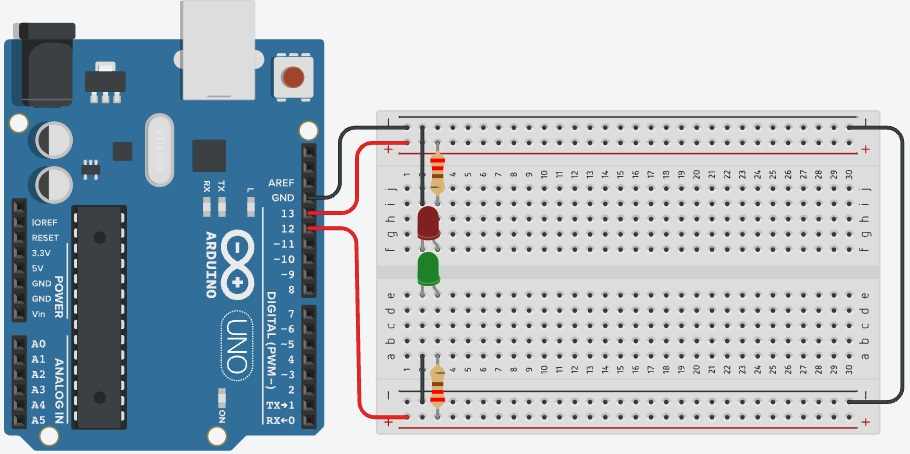

# Projeto Arduíno para manipular 2 leds em paralelo

## Contextualização

Neste experimento faremos  com que o LED incorporado e dois LEDs pisquem alternadamente utilizando o pino digital 13 (pino digital incorporado LED_BUILTIN = 13) e o pino digital 12. 

## Esquema do projeto

## Projeto no Tinkercad

https://www.tinkercad.com/things/ly8Nf2KDtv4